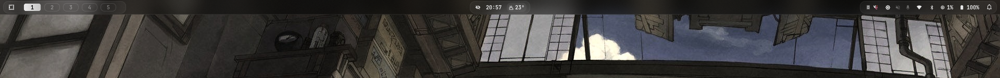
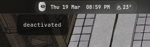
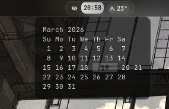
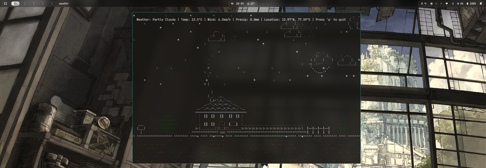
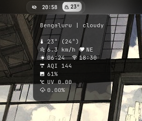

# Arch Hyprland Dotfiles 🚀




Minimal, modular, and dynamic Hyprland setup with custom scripts for weather, nightlight, and lockscreen.

---

## ✨ What is this?

This is my personal **Hyprland + Waybar + SwayNC setup** with:

- 🌍 Shared location system (`location.sh`)
- 🌤 Weather integration (Waybar + Hyprlock)
- 🌇 Auto nightlight (sunrise/sunset based)
- 🔋 Lockscreen info (weather + battery)
- 🔔 Notification system (SwayNC)
- 🧩 Modular configs (clean separation)

---

## 📸 Preview

| Clock                 | Calendar                 |
| --------------------- | ------------------------ |
|  |  |

| Weather                 | Tooltip                         |
| ----------------------- | ------------------------------- |
|  |  |

---

## 📦 Contents

### 🪟 Hyprland

- `hyprland.conf` → main config
- `autostart.conf` → startup apps
- `bindings.conf` → keybinds
- `monitors.conf` → display setup
- `input.conf` → input config
- `looknfeel.conf` → appearance
- `hyprlock.conf` → lockscreen
- `hyprsunset.conf` → generated nightlight config

---

### 📊 Waybar

- `config.jsonc` → bar layout
- `style.css` → styling

---

### 🔔 SwayNC

- `config.json` → notifications
- `style.css` → styling

---

### ⚙️ Scripts

Located in `scripts/`:

- `location.sh` → shared location (cached)
- `waybar-weather.sh` → weather module
- `hyprlock-weather.sh` → lockscreen info
- `hyprsunset-auto.sh` → auto nightlight
- `music-progress.sh` → media progress

---

## ⚡ Requirements

Make sure you have:

- `hyprland`
- `waybar`
- `swaync`
- `jq`
- `curl`
- `brightnessctl`
- `pamixer`

### For weather terminal UI

```bash
yay -S weathr-bin
```

---

## 🚀 Installation

### 1. Clone the repo

```bash
git clone https://github.com/grvsnh/arch-hyprland-dot-files.git
```

```bash
cd arch-hyprland-dot-files
```

---

### 2. Unhide `.config`

In your file manager:

- Press `Ctrl + H` to show hidden files
- Open your home directory

---

### 3. Copy configs

Drag and drop these folders into `~/.config/`:

- `hypr`
- `waybar`
- `swaync`
- `scripts`

👉 Replace existing files if prompted

---

### 4. Make scripts executable

```bash
chmod +x ~/.config/scripts/*.sh
```

---

### 5. Restart Hyprland

Either:

- Log out and log back in
- or run:

```bash
hyprctl reload
```

---

## 🧠 Notes

- No hardcoded user paths
- Scripts are portable
- Uses caching for performance
- Nightlight adjusts automatically using real sunrise/sunset
